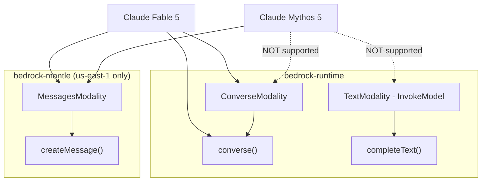
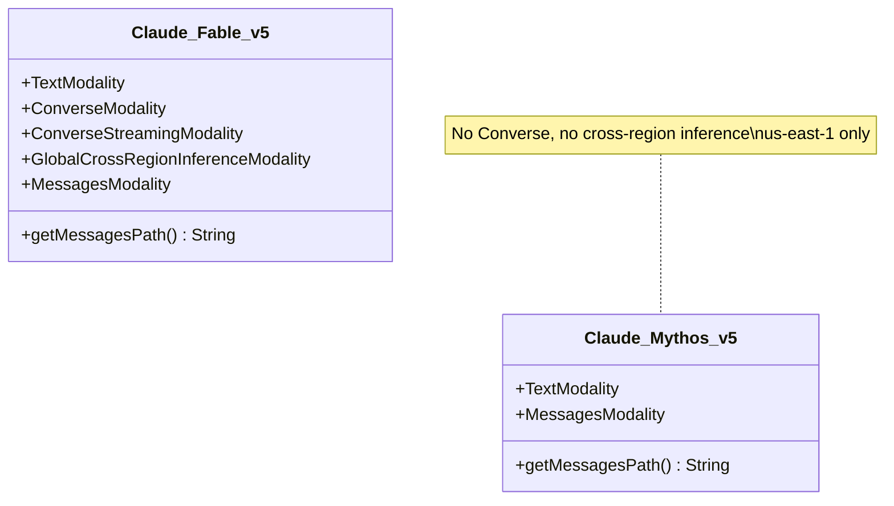
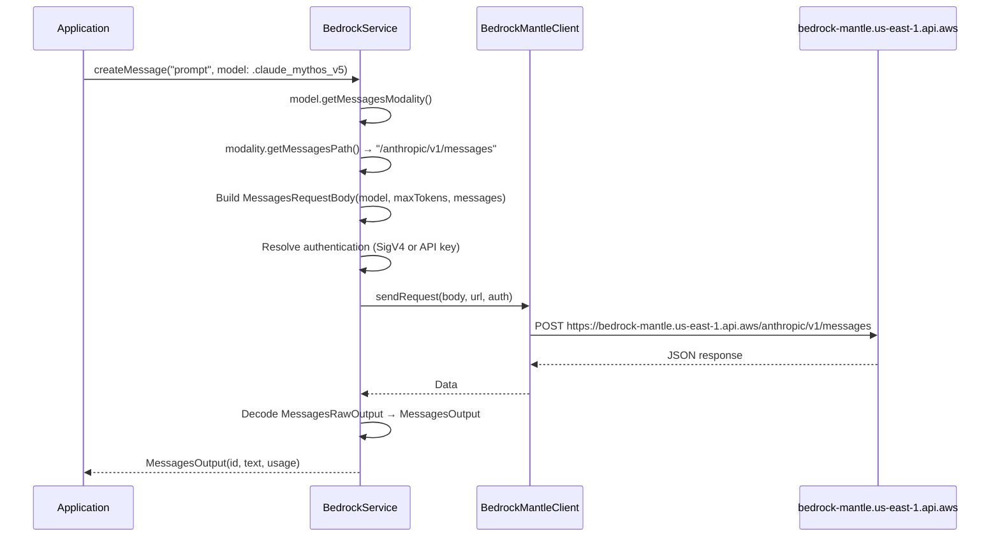

# Design Document: Claude Mythos 5 Model Support

## Overview

This design adds Claude Mythos 5 (`anthropic.claude-mythos-5`) to the Swift Bedrock Library. Mythos 5 is a next-generation Anthropic model with a 1M token context window and 128K max output tokens, available exclusively via the Messages API on the bedrock-mantle endpoint in us-east-1.

Key differentiators from Claude Fable 5 (the closest existing model):
- **No cross-region inference** — us-east-1 only (no `GlobalCrossRegionInferenceModality`)
- **No Converse API support** — Messages API only (no `ConverseModality` / `ConverseStreamingModality`)
- **Strict sampling constraints** — temperature must be 1.0 or unset; top_p must be ≥ 0.99 and < 1.0 or unset; top_k not supported
- **Adaptive reasoning always on** — reasoning cannot be disabled, effort level is configurable

The implementation introduces a new `Claude_Mythos_v5` modality struct that conforms only to `TextModality` and `MessagesModality` — the minimal protocol set for a bedrock-mantle-only model without Converse support.

## Architecture

### Endpoint Routing



### Comparison with Claude Fable 5



### Message Flow



## Components and Interfaces

### New Files

| File | Purpose |
|------|---------|
| (none) | All changes fit in existing files |

### Modified Files

| File | Change |
|------|--------|
| `Sources/BedrockService/Models/Anthropic/AnthropicGlobalModels.swift` | Add `Claude_Mythos_v5` struct |
| `Sources/BedrockService/Models/Anthropic/AnthropicBedrockModels.swift` | Add `BedrockModel.claude_mythos_v5` static constant |
| `Sources/BedrockService/Models/BedrockModel.swift` | Add case in `init?(rawValue:)` switch |

### `Claude_Mythos_v5` Struct

```swift
struct Claude_Mythos_v5: TextModality, MessagesModality {
    private let anthropicText: AnthropicText

    init(parameters: TextGenerationParameters, features: [ConverseFeature], maxReasoningTokens: Parameter<Int>) {
        self.anthropicText = AnthropicText(
            parameters: parameters,
            features: features,
            maxReasoningTokens: maxReasoningTokens
        )
    }

    func getName() -> String { anthropicText.getName() }
    func getParameters() -> TextGenerationParameters { anthropicText.getParameters() }
    func getMessagesPath() -> String { "/anthropic/v1/messages" }

    func getTextRequestBody(
        prompt: String,
        maxTokens: Int?,
        temperature: Double?,
        topP: Double?,
        topK: Int?,
        stopSequences: [String]?,
        serviceTier: ServiceTier
    ) throws -> BedrockBodyCodable {
        try anthropicText.getTextRequestBody(
            prompt: prompt,
            maxTokens: maxTokens,
            temperature: temperature,
            topP: topP,
            topK: topK,
            stopSequences: stopSequences,
            serviceTier: serviceTier
        )
    }

    func getTextResponseBody(from data: Data) throws -> ContainsTextCompletion {
        try anthropicText.getTextResponseBody(from: data)
    }
}
```

**Key design decisions:**

1. **No `ConverseModality` / `ConverseStreamingModality`**: The Converse API is explicitly not supported for Mythos 5. Calling `model.hasConverseModality()` returns `false`.

2. **No `GlobalCrossRegionInferenceModality`**: Mythos 5 is us-east-1 only. `getModelIdWithCrossRegionInferencePrefix(region:)` returns the plain model ID with no prefix.

3. **No `CrossRegionInferenceModality`**: Not even regional cross-region. Single-region only.

4. **Delegates to `AnthropicText`**: Reuses the existing request/response body serialization. The `TextModality` conformance is needed for parameter access (`getParameters()`) and request body building — even though InvokeModel isn't the primary API, the library's parameter validation infrastructure lives on `TextModality`.

5. **Messages path**: Returns `"/anthropic/v1/messages"` — same path as Fable 5.

### `BedrockModel.claude_mythos_v5` Static Constant

```swift
extension BedrockModel {
    public static let claude_mythos_v5: BedrockModel = BedrockModel(
        id: "anthropic.claude-mythos-5",
        name: "Claude Mythos 5",
        modality: Claude_Mythos_v5(
            parameters: TextGenerationParameters(
                temperature: Parameter(.temperature, minValue: 1, maxValue: 1, defaultValue: 1),
                maxTokens: Parameter(.maxTokens, minValue: 1, maxValue: 128_000, defaultValue: 8_192),
                topP: Parameter(.topP, minValue: 0.99, maxValue: 1, defaultValue: nil),
                topK: Parameter.notSupported(.topK),
                stopSequences: StopSequenceParams(maxSequences: 8191, defaultValue: []),
                maxPromptSize: 1_000_000
            ),
            features: [.textGeneration, .systemPrompts, .document, .vision, .toolUse, .reasoning, .structuredOutput],
            maxReasoningTokens: Parameter(.maxReasoningTokens, minValue: 1_024, maxValue: 8_191, defaultValue: 4_096)
        )
    )
}
```

**Parameter rationale:**

| Parameter | Value | Rationale |
|-----------|-------|-----------|
| `temperature` | min: 1, max: 1, default: 1 | Must be 1.0 or unset — clamped to single value |
| `maxTokens` | min: 1, max: 128,000, default: 8,192 | 128K output capacity; 8K default matches library convention |
| `topP` | min: 0.99, max: 1, default: nil | Must be ≥ 0.99 and < 1.0 or unset; nil default means "unset" |
| `topK` | `.notSupported` | Not supported at all |
| `maxPromptSize` | 1,000,000 | 1M token context window |
| `maxReasoningTokens` | min: 1,024, max: 8,191, default: 4,096 | Reasoning always on; effort configurable |

### `BedrockModel.init?(rawValue:)` Addition

```swift
// In the switch statement, add:
case BedrockModel.claude_mythos_v5.id:
    self = BedrockModel.claude_mythos_v5
```

## Data Models

### Protocol Conformance Summary

| Check | Claude Mythos 5 | Claude Fable 5 (reference) |
|-------|-----------------|---------------------------|
| `hasTextModality()` | `true` | `true` |
| `hasMessagesModality()` | `true` | `true` |
| `hasConverseModality()` | `false` | `true` |
| `hasConverseStreamingModality()` | `false` | `true` |
| `hasImageModality()` | `false` | `false` |
| `hasEmbeddingsModality()` | `false` | `false` |
| `hasResponsesModality()` | `false` | `false` |
| Cross-region inference | None (plain ID) | Global prefix (`global.`) |

### Model Metadata

| Field | Value |
|-------|-------|
| Model ID | `anthropic.claude-mythos-5` |
| Display Name | Claude Mythos 5 |
| Endpoint | bedrock-mantle |
| API Path | `/anthropic/v1/messages` |
| Region | us-east-1 only |
| Context Window | 1,000,000 tokens |
| Max Output | 128,000 tokens |
| Reasoning | Always on (adaptive) |
| Prompt Caching | Yes (min 1024 tokens, max 4 breakpoints, TTL 5min/1hr) |
| Service Tier | Standard only |
| Launch Date | June 9, 2026 |

### Wire Format (Messages API)

**Request** (reuses existing `MessagesRequestBody`):

```json
{
  "model": "anthropic.claude-mythos-5",
  "max_tokens": 8192,
  "messages": [
    {"role": "user", "content": "Explain quantum computing"}
  ]
}
```

**Response** (reuses existing `MessagesRawOutput`):

```json
{
  "id": "msg_01abc123",
  "type": "message",
  "role": "assistant",
  "model": "anthropic.claude-mythos-5",
  "content": [
    {"type": "thinking", "thinking": "Let me reason about this..."},
    {"type": "text", "text": "Quantum computing is..."}
  ],
  "stop_reason": "end_turn",
  "usage": {
    "input_tokens": 12,
    "output_tokens": 256
  }
}
```

## Key Functions with Formal Specifications

### Function: `Claude_Mythos_v5.getTextRequestBody()`

```swift
func getTextRequestBody(
    prompt: String,
    maxTokens: Int?,
    temperature: Double?,
    topP: Double?,
    topK: Int?,
    stopSequences: [String]?,
    serviceTier: ServiceTier
) throws -> BedrockBodyCodable
```

**Preconditions:**
- `prompt` is non-empty
- If `maxTokens` is non-nil: 1 ≤ `maxTokens` ≤ 128,000
- If `temperature` is non-nil: `temperature` == 1.0
- If `topP` is non-nil: 0.99 ≤ `topP` < 1.0
- `topK` must be nil (not supported)
- `temperature` and `topP` must not both be non-nil

**Postconditions:**
- Returns a valid `AnthropicRequestBody` that serializes to JSON
- If `maxTokens` was nil and parameter has no default, throws `notFound`
- If both `topP` and `temperature` are non-nil, throws `notSupported`
- Returned body contains the `prompt` text
- Returned body contains resolved `maxTokens` value

**Loop Invariants:** N/A

### Function: `Claude_Mythos_v5.getMessagesPath()`

```swift
func getMessagesPath() -> String
```

**Preconditions:** None

**Postconditions:**
- Returns exactly `"/anthropic/v1/messages"`
- Return value is constant across all invocations

**Loop Invariants:** N/A

### Function: `BedrockModel.getModelIdWithCrossRegionInferencePrefix(region:)`

```swift
func getModelIdWithCrossRegionInferencePrefix(region: Region) -> String
```

**Preconditions:**
- `self` == `.claude_mythos_v5`
- `region` is any valid `Region`

**Postconditions:**
- Returns `"anthropic.claude-mythos-5"` (no prefix) for ALL regions
- The model's modality does not conform to `GlobalCrossRegionInferenceModality`
- The model's modality does not conform to `CrossRegionInferenceModality`

**Loop Invariants:** N/A

## Algorithmic Pseudocode

### Model Resolution from Raw Value

```swift
// Within BedrockModel.init?(rawValue:)
// Existing switch statement gains one new case:

switch rawValue {
    // ... existing cases ...
    case "anthropic.claude-mythos-5":
        self = BedrockModel.claude_mythos_v5
    // ... remaining cases ...
    default:
        return nil
}
```

### createMessage Flow for Mythos 5

```swift
// BedrockService.createMessage with Claude Mythos 5
// Step 1: Verify modality
let modality = try model.getMessagesModality()
// → succeeds: Claude_Mythos_v5 conforms to MessagesModality

// Step 2: Get path
let path = modality.getMessagesPath()
// → "/anthropic/v1/messages"

// Step 3: Build request body
let requestBody = MessagesRequestBody(model: model, maxTokens: maxTokens, messages: messages)

// Step 4: Construct URL
let urlString = "https://bedrock-mantle.\(region.rawValue).api.aws\(path)"
// → "https://bedrock-mantle.us-east-1.api.aws/anthropic/v1/messages"

// Step 5: Resolve auth and send
let mantleAuth = try await resolveMantleAuthentication(authentication)
let responseData = try await client.sendRequest(body: bodyData, url: url, authentication: mantleAuth)

// Step 6: Decode
let rawOutput = try decoder.decode(MessagesRawOutput.self, from: responseData)
let output = try MessagesOutput(from: rawOutput)
```

### Parameter Validation — topP Constraint

```swift
// The topP parameter is declared as:
// Parameter(.topP, minValue: 0.99, maxValue: 1, defaultValue: nil)
//
// When the user provides topP:
//   - If topP < 0.99 → parameter validation throws invalidParameter
//   - If topP >= 1.0 → parameter validation throws invalidParameter
//   - If topP is nil → parameter is omitted from request (default = nil means "unset")
//   - If topP in [0.99, 1.0) → valid, included in request
//
// Note: The maxValue of 1 in the Parameter declaration is exclusive for topP
// due to the AWS constraint "< 1.0". The validation logic in the library
// checks value <= maxValue, so in practice topP = 1.0 would pass parameter
// validation but be rejected by the API. This matches the Fable 5 pattern.
```

## Example Usage

```swift
import BedrockService

// Initialize the service in us-east-1
let bedrock = try BedrockService(region: .useast1)

// Simple message
let output = try await bedrock.createMessage(
    "Explain the Riemann hypothesis",
    with: .claude_mythos_v5,
    authentication: .default
)
print(output.text)

// Multi-turn conversation
let messages: [AnthropicMessage] = [
    AnthropicMessage(role: .user, content: "What is quantum entanglement?"),
    AnthropicMessage(role: .assistant, content: "Quantum entanglement is..."),
    AnthropicMessage(role: .user, content: "How is it used in computing?"),
]
let reply = try await bedrock.createMessage(
    messages,
    with: .claude_mythos_v5,
    maxTokens: 16_384,
    authentication: .default
)
print(reply.text)

// Model lookup from raw string
if let model = BedrockModel(rawValue: "anthropic.claude-mythos-5") {
    print(model.name) // "Claude Mythos 5"
    print(model.hasMessagesModality()) // true
    print(model.hasConverseModality()) // false
}

// Cross-region prefix (no-op for Mythos 5)
let prefixedId = BedrockModel.claude_mythos_v5
    .getModelIdWithCrossRegionInferencePrefix(region: .useast1)
// → "anthropic.claude-mythos-5" (no prefix applied)
```

## Correctness Properties

*A property is a characteristic or behavior that should hold true across all valid executions of a system — essentially, a formal statement about what the system should do. Properties serve as the bridge between human-readable specifications and machine-verifiable correctness guarantees.*

### Property 1: Model resolves from raw value

*For any* call to `BedrockModel(rawValue: "anthropic.claude-mythos-5")`, the result SHALL be non-nil and its `id` SHALL equal `"anthropic.claude-mythos-5"` and its `name` SHALL equal `"Claude Mythos 5"`.

**Validates: Requirements 1.1, 1.2, 1.3**

### Property 2: Messages modality is present and returns correct path

*For any* instance of `BedrockModel.claude_mythos_v5`, calling `hasMessagesModality()` SHALL return `true`, and calling `getMessagesModality().getMessagesPath()` SHALL return `"/anthropic/v1/messages"`.

**Validates: Requirements 2.1, 2.2**

### Property 3: Converse modality is absent

*For any* instance of `BedrockModel.claude_mythos_v5`, calling `hasConverseModality()` SHALL return `false`, and calling `getConverseModality()` SHALL throw `BedrockLibraryError.invalidModality`.

**Validates: Requirements 3.1, 3.3**

### Property 4: No cross-region inference prefix applied

*For any* valid `Region` value, calling `BedrockModel.claude_mythos_v5.getModelIdWithCrossRegionInferencePrefix(region:)` SHALL return `"anthropic.claude-mythos-5"` without any prefix.

**Validates: Requirements 4.1**

### Property 5: Temperature range enforcement

*For any* temperature value where `temperature != 1.0`, parameter validation on Claude Mythos 5 SHALL reject it (the declared range is [1, 1], so only exactly 1.0 is valid).

**Validates: Requirements 5.1, 5.3**

### Property 6: TopK rejection

*For any* non-nil `topK` value provided to `getTextRequestBody()` on Claude Mythos 5, the `AnthropicText` implementation SHALL handle it according to its existing logic (topK is declared as `.notSupported`).

**Validates: Requirements 7.1, 7.2**

### Property 7: TopP range enforcement

*For any* `topP` value where `topP < 0.99`, parameter validation on Claude Mythos 5 SHALL reject it. *For any* `topP` value where `0.99 ≤ topP < 1.0`, it SHALL be accepted.

**Validates: Requirements 6.1, 6.2, 6.3**

### Property 8: Unknown raw values resolve to nil

*For any* string that is not a known model ID (e.g., random UUIDs, "anthropic.claude-mythos-6"), `BedrockModel(rawValue:)` SHALL return nil.

**Validates: Requirements 1.4**

## Error Handling

| Scenario | Error | Recovery |
|----------|-------|----------|
| Call `getConverseModality()` on Mythos 5 | `BedrockLibraryError.invalidModality` | Caller should use `createMessage()` instead |
| Call `getConverseStreamingModality()` on Mythos 5 | `false` from `hasConverseStreamingModality()` | Caller should use Messages API |
| Both temperature and topP provided | `BedrockLibraryError.notSupported` | Provide at most one |
| Temperature not equal to 1.0 | `BedrockLibraryError.invalidParameter` | Use 1.0 or omit |
| topP < 0.99 | `BedrockLibraryError.invalidParameter` | Use value in [0.99, 1.0) or omit |
| maxTokens > 128,000 | `BedrockLibraryError.invalidParameter` | Use value ≤ 128,000 |
| `createMessage()` called with region ≠ us-east-1 | API returns HTTP error | Service configured for us-east-1 |
| Invalid/expired credentials | `BedrockLibraryError.authenticationError` | Refresh credentials |
| Model ID not found in `init?(rawValue:)` | Returns `nil` | Check for typos in model ID |

## Testing Strategy

### Test Framework

All tests use Swift Testing (`@Suite`, `@Test`, `#expect`, `#require`) as per project conventions. Run with `swift test`.

### Unit Tests (Example-Based)

Organized in:
- `Tests/Messages/MythosModelTests.swift` — model constant, modality checks, parameter declarations

Coverage:
- Model constant: ID == `"anthropic.claude-mythos-5"`, name == `"Claude Mythos 5"`
- `hasMessagesModality()` → `true`
- `hasConverseModality()` → `false`
- `hasConverseStreamingModality()` → `false`
- `hasImageModality()` → `false`
- `hasEmbeddingsModality()` → `false`
- `hasResponsesModality()` → `false`
- `hasTextModality()` → `true`
- `getMessagesPath()` → `"/anthropic/v1/messages"`
- `BedrockModel(rawValue: "anthropic.claude-mythos-5")` → non-nil, correct model
- `BedrockModel(rawValue: "anthropic.claude-mythos-6")` → nil
- `getModelIdWithCrossRegionInferencePrefix(region: .useast1)` → `"anthropic.claude-mythos-5"`
- `getModelIdWithCrossRegionInferencePrefix(region: .euwest1)` → `"anthropic.claude-mythos-5"` (still no prefix)
- Parameter values: temperature range [1,1], topP range [0.99, 1], topK not supported, maxTokens [1, 128000], maxPromptSize 1M
- Features list includes `.reasoning`
- `maxReasoningTokens` parameter supported (min 1024, max 8191, default 4096)

### Property-Based Tests

Using Swift Testing's `@Test(..., arguments:)` with generated value arrays:

| Property | Strategy |
|----------|----------|
| 4: No cross-region prefix | Test with all known Region enum cases; verify output == `"anthropic.claude-mythos-5"` for every region |
| 5: Temperature range | Generate 100 values outside [1,1] (random doubles in [0, 0.99] ∪ (1.0, 2.0]); verify parameter validation rejects each |
| 7: TopP range | Generate 100 values in [0, 0.989]; verify rejected. Generate 100 values in [0.99, 0.999]; verify accepted |
| 8: Unknown raw values | Generate 100 random UUID strings; verify `BedrockModel(rawValue:)` returns nil for each |

### Integration Tests (with Mocks)

Using existing `MockBedrockMantleClient`:
- `createMessage` with `.claude_mythos_v5` → correct URL contains `"bedrock-mantle"` and `"/anthropic/v1/messages"`
- `createMessage` with custom maxTokens → request body contains expected value
- Verify `createMessage` throws `invalidModality` when calling converse-related methods on Mythos 5

## Performance Considerations

- **Single region constraint**: Applications needing multi-region failover cannot use Mythos 5 as a fallback. Consider providing a helper/documentation note suggesting Fable 5 as a multi-region alternative.
- **128K output tokens**: Responses can be very large. Callers should set appropriate `maxTokens` values to control latency and cost.
- **Adaptive reasoning overhead**: Reasoning is always active — each response includes thinking tokens that count against output token usage.

## Security Considerations

- **Authentication**: Uses the same `BedrockAuthentication` patterns as all other models — SigV4 signing or API key Bearer token via bedrock-mantle.
- **Data retention**: Mythos 5 requires opt-in to `provider_data_share` via Data Retention API. This is an account-level configuration outside the library's scope, but worth documenting.
- **Prompt caching**: Supports caching with min 1024 tokens, max 4 breakpoints, TTL 5min/1hr. No library changes needed — caching is handled server-side.

## Dependencies

No new dependencies required. The implementation reuses:
- Existing `AnthropicText` struct for request/response handling
- Existing `MessagesModality` protocol
- Existing `BedrockMantleClient` for HTTP transport
- Existing `TextGenerationParameters` and `Parameter` types
