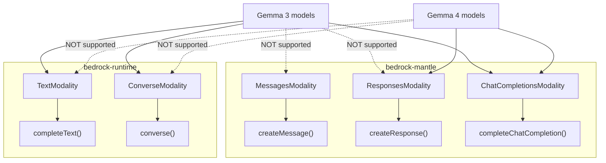
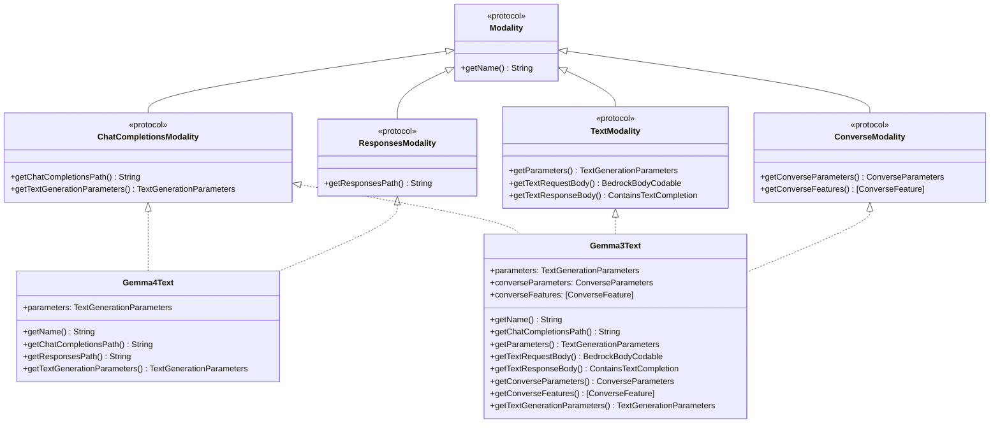

# Design Document: Gemma 4 Model Support

## Overview

This design adds all six Google Gemma models to the Swift Bedrock Library — three Gemma 4 models and three Gemma 3 models. The two generations differ in endpoint support and capabilities:

**Gemma 4 (mantle-only)**:
- `gemma4_31b` — 30.7B dense, 256K context
- `gemma4_26b_a4b` — 25.2B total / 3.8B active MoE, 256K context
- `gemma4_e2b` — 5.1B total / 2.3B effective PLE, 128K context

These support **ChatCompletionsModality** (`/openai/v1/chat/completions`) and **ResponsesModality** (`/openai/v1/responses`) exclusively on bedrock-mantle. They do NOT support InvokeModel or Converse on bedrock-runtime.

**Gemma 3 (dual-endpoint)**:
- `gemma3_27b_it` — 27B instruction-tuned, 128K context
- `gemma3_12b_it` — 12B instruction-tuned, 128K context
- `gemma3_4b_it` — 4B instruction-tuned, 128K context

These support **TextModality** (InvokeModel via bedrock-runtime), **ConverseModality** (Converse API via bedrock-runtime), and **ChatCompletionsModality** (`/v1/chat/completions` via bedrock-mantle). They do NOT support Responses or Messages APIs.

The implementation introduces:
1. A new `ChatCompletionsModality` protocol (analogous to `MessagesModality` / `ResponsesModality`)
2. A new `completeChatCompletion` method on `BedrockService`
3. A new `Sources/BedrockService/Models/Google/` provider directory
4. Two modality structs: `Gemma4Text` and `Gemma3Text`

The key insight is that Gemma 3 on bedrock-mantle uses path `/v1/chat/completions` (not `/openai/v1/`), while Gemma 4 uses `/openai/v1/chat/completions`. The `ChatCompletionsModality` protocol's `getChatCompletionsPath()` method encodes this difference per model.

## Architecture

### Endpoint Routing



### Modality Struct Design



### Key Architectural Decisions

1. **New `ChatCompletionsModality` protocol**: Mirrors `MessagesModality` and `ResponsesModality` — provides a path accessor and a parameters accessor. This is the cleanest way to express "this model supports text generation via the Chat Completions endpoint on bedrock-mantle" without conflating it with `TextModality` (which means InvokeModel support).

2. **Two distinct modality structs**: `Gemma4Text` conforms to `ChatCompletionsModality + ResponsesModality`. `Gemma3Text` conforms to `TextModality + ConverseModality + ChatCompletionsModality`. This keeps the protocol conformances accurate — each model only claims capabilities it actually supports.

3. **Gemma 3 reuses OpenAI wire format for InvokeModel**: The Gemma 3 models on bedrock-runtime use the same JSON request/response schema as the existing OpenAI OSS models (`OpenAIRequestBody` / `OpenAIResponseBody`). The `Gemma3Text` struct's `getTextRequestBody()` and `getTextResponseBody()` methods produce the same types.

4. **Path difference encoded in modality**: Gemma 4 returns `/openai/v1/chat/completions` from `getChatCompletionsPath()`, Gemma 3 returns `/v1/chat/completions`. The `completeChatCompletion` method simply concatenates `https://bedrock-mantle.{region}.api.aws` + the path from the modality.

5. **Shared `ChatCompletionsRequestBody` / `ChatCompletionsOutput`**: Both Gemma 4 and Gemma 3 use identical wire format for Chat Completions (same as OpenAI chat completions schema). A single request body type and output type serves both.

6. **New `BedrockModel` modality checks**: `hasChatCompletionsModality()` and `getChatCompletionsModality()` are added to `BedrockModel` following the exact pattern of the existing checks.

## Components and Interfaces

### New Files

| File | Purpose |
|------|---------|
| `Sources/BedrockService/BedrockRuntimeClient/Modalities/ChatCompletionsModality.swift` | `ChatCompletionsModality` protocol definition |
| `Sources/BedrockService/BedrockRuntimeClient/ChatCompletions/BedrockService+ChatCompletions.swift` | `completeChatCompletion` service method |
| `Sources/BedrockService/BedrockRuntimeClient/ChatCompletions/ChatCompletionsInput.swift` | `ChatCompletionsRequestBody` type |
| `Sources/BedrockService/BedrockRuntimeClient/ChatCompletions/ChatCompletionsOutput.swift` | `ChatCompletionsOutput` and raw response types |
| `Sources/BedrockService/Models/Google/Google.swift` | `Gemma4Text` and `Gemma3Text` modality structs |
| `Sources/BedrockService/Models/Google/GoogleBedrockModels.swift` | Six `BedrockModel` static constants |

### Modified Files

| File | Change |
|------|--------|
| `Sources/BedrockService/Models/BedrockModel.swift` | Add `hasChatCompletionsModality()`, `getChatCompletionsModality()`, and six new cases in `init?(rawValue:)` |

### `ChatCompletionsModality` Protocol

```swift
// Sources/BedrockService/BedrockRuntimeClient/Modalities/ChatCompletionsModality.swift

public protocol ChatCompletionsModality: Modality {
    func getChatCompletionsPath() -> String
    func getTextGenerationParameters() -> TextGenerationParameters
}
```

### `Gemma4Text` Struct

```swift
struct Gemma4Text: ChatCompletionsModality, ResponsesModality {
    let parameters: TextGenerationParameters

    func getName() -> String { "Gemma 4 Text Generation" }
    func getChatCompletionsPath() -> String { "/openai/v1/chat/completions" }
    func getResponsesPath() -> String { "/openai/v1/responses" }
    func getTextGenerationParameters() -> TextGenerationParameters { parameters }
}
```

### `Gemma3Text` Struct

```swift
struct Gemma3Text: TextModality, ConverseModality, ChatCompletionsModality {
    let parameters: TextGenerationParameters
    let converseParameters: ConverseParameters
    let converseFeatures: [ConverseFeature]

    func getName() -> String { "Gemma 3 Text Generation" }
    func getChatCompletionsPath() -> String { "/v1/chat/completions" }
    func getTextGenerationParameters() -> TextGenerationParameters { parameters }

    init(
        parameters: TextGenerationParameters,
        features: [ConverseFeature] = [.textGeneration, .vision, .systemPrompts]
    ) {
        self.parameters = parameters
        self.converseFeatures = features
        self.converseParameters = ConverseParameters(textGenerationParameters: parameters)
    }

    func getParameters() -> TextGenerationParameters { parameters }

    func getTextRequestBody(
        prompt: String,
        maxTokens: Int?,
        temperature: Double?,
        topP: Double?,
        topK: Int?,
        stopSequences: [String]?,
        serviceTier: ServiceTier
    ) throws -> BedrockBodyCodable {
        guard let maxTokens = maxTokens ?? parameters.maxTokens.defaultValue else {
            throw BedrockLibraryError.notFound(
                "No value was given for maxTokens and no default value was found"
            )
        }
        if topP != nil && temperature != nil {
            throw BedrockLibraryError.notSupported(
                "Alter either topP or temperature, but not both."
            )
        }
        guard topK == nil else {
            throw BedrockLibraryError.notSupported(
                "TopK is not supported for Gemma 3 text completion"
            )
        }
        return OpenAIRequestBody(
            prompt: prompt,
            maxTokens: maxTokens,
            temperature: temperature ?? parameters.temperature.defaultValue,
            topP: topP ?? parameters.topP.defaultValue,
            serviceTier: serviceTier
        )
    }

    func getTextResponseBody(from data: Data) throws -> ContainsTextCompletion {
        let decoder = JSONDecoder()
        return try decoder.decode(OpenAIResponseBody.self, from: data)
    }
}
```

### `BedrockService.completeChatCompletion` Method

```swift
extension BedrockService {
    public func completeChatCompletion(
        _ input: String,
        with model: BedrockModel,
        maxTokens: Int? = nil,
        temperature: Double? = nil,
        topP: Double? = nil,
        serviceTier: ServiceTier = .default,
        authentication: BedrockAuthentication,
        mantleClient: BedrockMantleClientProtocol? = nil
    ) async throws -> ChatCompletionsOutput
}
```

Method flow:
1. Call `model.getChatCompletionsModality()` — throws `invalidModality` if not supported
2. Get parameters via `modality.getTextGenerationParameters()`
3. Validate: if both topP and temperature are non-nil, throw `notSupported`
4. Validate: if topK is non-nil, throw `notSupported` (signature doesn't expose topK, keeping it safe)
5. Validate: temperature/maxTokens/topP ranges via `parameters.validate(...)`
6. Construct `ChatCompletionsRequestBody` with model ID, messages, maxTokens, temperature/topP, serviceTier
7. Build URL: `https://bedrock-mantle.{region}.api.aws{modality.getChatCompletionsPath()}`
8. Resolve authentication via `resolveMantleAuthentication`
9. Send request via `BedrockMantleClient.sendRequest`
10. Decode response into `ChatCompletionsRawOutput`, convert to `ChatCompletionsOutput`

### `BedrockModel` Additions

```swift
// Modality checks
extension BedrockModel {
    public func hasChatCompletionsModality() -> Bool {
        modality as? any ChatCompletionsModality != nil
    }

    public func getChatCompletionsModality() throws -> any ChatCompletionsModality {
        guard let chatCompletionsModality = modality as? any ChatCompletionsModality else {
            throw BedrockLibraryError.invalidModality(
                self,
                modality,
                "Model \(id) does not support the Chat Completions API"
            )
        }
        return chatCompletionsModality
    }
}

// init?(rawValue:) additions — six new cases in the switch:
case BedrockModel.gemma4_31b.id: self = BedrockModel.gemma4_31b
case BedrockModel.gemma4_26b_a4b.id: self = BedrockModel.gemma4_26b_a4b
case BedrockModel.gemma4_e2b.id: self = BedrockModel.gemma4_e2b
case BedrockModel.gemma3_27b_it.id: self = BedrockModel.gemma3_27b_it
case BedrockModel.gemma3_12b_it.id: self = BedrockModel.gemma3_12b_it
case BedrockModel.gemma3_4b_it.id: self = BedrockModel.gemma3_4b_it
```

### Protocol Conformance Summary

| Check | Gemma 4 (all 3) | Gemma 3 (all 3) |
|-------|-----------------|-----------------|
| `hasTextModality()` | `false` | `true` |
| `hasChatCompletionsModality()` | `true` | `true` |
| `hasResponsesModality()` | `true` | `false` |
| `hasConverseModality()` | `false` | `true` |
| `hasMessagesModality()` | `false` | `false` |
| `hasImageModality()` | `false` | `false` |

## Data Models

### Text Generation Parameters

All six models share identical parameter ranges:

| Parameter | Min | Max | Default | Supported |
|-----------|-----|-----|---------|-----------|
| temperature | 0 | 2 | 1 | ✓ |
| maxTokens | 1 | 8192 | 8192 | ✓ |
| topP | 0 | 1 | 1 | ✓ |
| topK | — | — | — | ✗ |
| stopSequences | — | — | — | ✗ |

Constraints (both InvokeModel and Chat Completions paths):
- temperature and topP are mutually exclusive — providing both non-nil throws `notSupported`
- topK is not supported — providing a non-nil value throws `notSupported`

### `ChatCompletionsRequestBody`

```swift
struct ChatCompletionsRequestBody: Codable, Sendable {
    let model: String
    let max_completion_tokens: Int
    let messages: [ChatCompletionsMessage]
    let service_tier: String
    let temperature: Double?
    let top_p: Double?
}

struct ChatCompletionsMessage: Codable, Sendable {
    let role: String
    let content: String
}
```

Serialized JSON sent to bedrock-mantle:

```json
{
  "model": "google.gemma-4-31b",
  "max_completion_tokens": 8192,
  "messages": [{"role": "user", "content": "Hello"}],
  "service_tier": "default",
  "temperature": 1.0
}
```

### `ChatCompletionsOutput`

```swift
public struct ChatCompletionsOutput: Sendable {
    public let id: String
    public let text: String
    public let model: String
    public let usage: ChatCompletionsUsage
}

public struct ChatCompletionsUsage: Sendable {
    public let promptTokens: Int
    public let completionTokens: Int
    public let totalTokens: Int
}
```

### Raw Response JSON (from bedrock-mantle)

```json
{
  "id": "chatcmpl-abc123",
  "choices": [
    {
      "finish_reason": "stop",
      "index": 0,
      "message": {"content": "Generated text here", "role": "assistant"}
    }
  ],
  "created": 1234567890,
  "model": "google.gemma-4-31b",
  "object": "chat.completion",
  "usage": {"completion_tokens": 42, "prompt_tokens": 10, "total_tokens": 52}
}
```

### Model Identifiers

| Model | ID | Name | Chat Completions Path |
|-------|-----|------|----------------------|
| Gemma 4 31B | `google.gemma-4-31b` | Gemma 4 31B | `/openai/v1/chat/completions` |
| Gemma 4 26B-A4B | `google.gemma-4-26b-a4b` | Gemma 4 26B-A4B | `/openai/v1/chat/completions` |
| Gemma 4 E2B | `google.gemma-4-e2b` | Gemma 4 E2B | `/openai/v1/chat/completions` |
| Gemma 3 27B IT | `google.gemma-3-27b-it` | Gemma 3 27B IT | `/v1/chat/completions` |
| Gemma 3 12B IT | `google.gemma-3-12b-it` | Gemma 3 12B IT | `/v1/chat/completions` |
| Gemma 3 4B IT | `google.gemma-3-4b-it` | Gemma 3 4B IT | `/v1/chat/completions` |

### Gemma 3 InvokeModel Wire Format

Gemma 3 on bedrock-runtime uses the same OpenAI-compatible JSON as the existing `openai_gpt_oss_20b` / `openai_gpt_oss_120b` models:

**Request** (reuses `OpenAIRequestBody`):
```json
{
  "max_completion_tokens": 8192,
  "messages": [{"role": "user", "content": "Hello"}],
  "service_tier": "default",
  "temperature": 1.0
}
```

**Response** (reuses `OpenAIResponseBody`):
```json
{
  "id": "chatcmpl-xyz",
  "choices": [{"finish_reason": "stop", "index": 0, "message": {"content": "...", "role": "assistant"}}],
  "created": 1234567890,
  "model": "google.gemma-3-27b-it",
  "object": "chat.completion",
  "usage": {"completion_tokens": 100, "prompt_tokens": 50, "total_tokens": 150}
}
```


## Correctness Properties

*A property is a characteristic or behavior that should hold true across all valid executions of a system — essentially, a formal statement about what the system should do. Properties serve as the bridge between human-readable specifications and machine-verifiable correctness guarantees.*

### Property 1: Unknown raw values resolve to nil

*For any* string that does not match any known model ID in the library, `BedrockModel(rawValue:)` SHALL return nil.

**Validates: Requirements 1.6**

### Property 2: Out-of-range parameter values are rejected

*For any* Gemma model (all six) and *for any* numeric value that falls outside the declared parameter range (temperature outside [0, 2], maxTokens outside [1, 8192], topP outside [0, 1]), parameter validation SHALL throw an error indicating the value is out of range.

**Validates: Requirements 7.8, 8.8, 9.5**

### Property 3: Chat Completions request serialization contains required fields

*For any* valid prompt string and *for any* valid parameter combination (maxTokens in [1, 8192], at most one of temperature/topP non-nil), serializing a `ChatCompletionsRequestBody` SHALL produce a JSON object containing the keys `model`, `max_completion_tokens`, `messages`, and `service_tier`.

**Validates: Requirements 10.2, 11.2**

### Property 4: Unsupported parameter combinations throw errors

*For any* Gemma model and *for any* pair of non-nil temperature and topP values, attempting text generation SHALL throw a `notSupported` error. Additionally, *for any* non-nil topK value, attempting text generation SHALL throw a `notSupported` error.

**Validates: Requirements 10.4, 10.5, 11.3, 11.4, 20.4, 20.5**

### Property 5: Chat Completions response parsing preserves content text

*For any* valid Chat Completions JSON response containing a non-empty `choices` array with a random `message.content` string, decoding into `ChatCompletionsOutput` SHALL produce an output whose `text` field equals the original content string.

**Validates: Requirements 12.1, 12.2**

### Property 6: InvokeModel response parsing preserves content text (Gemma 3)

*For any* valid OpenAI-format JSON response containing a non-empty `choices` array with a random `message.content` string, decoding via `getTextResponseBody()` on a Gemma 3 modality SHALL produce a `TextCompletion` whose `completion` field equals the original content string.

**Validates: Requirements 16.5, 20.1, 20.2**

## Error Handling

| Scenario | Error | Message |
|----------|-------|---------|
| topK provided (non-nil) for any Gemma model | `BedrockLibraryError.notSupported` | "TopK is not supported for Gemma {3\|4} text completion" |
| Both temperature and topP provided (non-nil) | `BedrockLibraryError.notSupported` | "Alter either topP or temperature, but not both." |
| Parameter out of declared range | `BedrockLibraryError.invalidParameter` | Includes parameter name and valid bounds |
| Empty `choices` array in Chat Completions response | `BedrockLibraryError.completionNotFound` | "No choices available in Chat Completions response" |
| Empty `choices` array in InvokeModel response (Gemma 3) | `BedrockLibraryError.completionNotFound` | "OpenAIResponseBody: no choices available" |
| Invalid JSON response from bedrock-mantle | `BedrockLibraryError.invalidSDKResponse` | "bedrock-mantle returned HTTP {code}: {message}" |
| Invalid JSON response from InvokeModel | Swift `DecodingError` | Standard JSONDecoder error |
| `getTextModality()` on Gemma 4 | `BedrockLibraryError.invalidModality` | "Model {id} does not support text generation" |
| `getConverseModality()` on Gemma 4 | `BedrockLibraryError.invalidModality` | "Model {id} does not support text generation" |
| `getMessagesModality()` on any Gemma model | `BedrockLibraryError.invalidModality` | "Model {id} does not support the Messages API" |
| `getResponsesModality()` on Gemma 3 | `BedrockLibraryError.invalidModality` | "Model {id} does not support the Responses API" |
| `getImageModality()` on any Gemma model | `BedrockLibraryError.invalidModality` | "Model {id} does not support image generation" |
| `getChatCompletionsModality()` on non-conforming model | `BedrockLibraryError.invalidModality` | "Model {id} does not support the Chat Completions API" |

## Testing Strategy

### Test Framework

All tests use Swift Testing (`@Suite`, `@Test`, `#expect`, `#require`) as per project conventions. Run with `swift test`.

### Unit Tests (Example-Based)

Organized in:
- `Tests/ChatCompletions/ChatCompletionsModelTests.swift` — model constants, modality checks, parameter declarations
- `Tests/ChatCompletions/ChatCompletionsRequestTests.swift` — request body serialization specifics
- `Tests/ChatCompletions/ChatCompletionsResponseTests.swift` — response parsing, edge cases
- `Tests/ChatCompletions/ChatCompletionsServiceTests.swift` — service method integration with mocks

Coverage:
- All 6 model constants (ID, name)
- All modality presence/absence checks (table from Protocol Conformance Summary)
- Chat Completions path values (`/openai/v1/chat/completions` vs `/v1/chat/completions`)
- Responses path value (`/openai/v1/responses`) for Gemma 4
- Raw value initialization for all 6 models
- Unknown raw value → nil
- Error throws for unsupported modality access
- Default parameter usage in request bodies
- Empty choices error (Chat Completions)
- Empty choices error (InvokeModel / OpenAIResponseBody)
- Invalid JSON error handling
- URL construction for both Gemma 4 and Gemma 3 endpoints
- Converse features (textGeneration, vision, systemPrompts) for Gemma 3
- Service tier default ("default") in request body

### Property-Based Tests

Using Swift Testing's `@Test(..., arguments:)` with generated value arrays (minimum 100 test values per property):

| Property | Test Location | Strategy |
|----------|--------------|----------|
| 1: Unknown raw values → nil | `ChatCompletionsModelTests` | Generate 100 random UUID strings, verify all return nil from `BedrockModel(rawValue:)` |
| 2: Out-of-range rejection | `ChatCompletionsModelTests` | Generate 100 random out-of-range values for temperature (< 0 or > 2), maxTokens (< 1 or > 8192), topP (< 0 or > 1); verify validation throws for each Gemma model |
| 3: Request serialization keys | `ChatCompletionsRequestTests` | Generate 100 random prompts (1-500 chars) with random valid maxTokens, serialize, verify JSON contains required keys |
| 4: Unsupported params throw | `ChatCompletionsRequestTests` | Generate 100 random (temperature, topP) pairs both non-nil, verify throws; generate 100 random topK values, verify throws |
| 5: Response parsing round-trip | `ChatCompletionsResponseTests` | Generate 100 random content strings, embed in valid response JSON template, decode, verify `output.text == original` |
| 6: InvokeModel response round-trip | `ChatCompletionsResponseTests` | Generate 100 random content strings, embed in OpenAI response JSON, decode via Gemma3Text.getTextResponseBody(), verify `completion == original` |

**Configuration**:
- Each property test tagged with comment: `// Feature: gemma4-model-support, Property {N}: {description}`
- Minimum 100 iterations per property

### Integration Tests (with Mocks)

Using `MockBedrockMantleClient` (extended for Chat Completions responses) and `MockBedrockRuntimeClient`:

- `completeChatCompletion` with Gemma 4 model → correct URL, correct response
- `completeChatCompletion` with Gemma 3 model → correct URL (`/v1/...`), correct response
- `createResponse` with Gemma 4 model → correct URL, correct response
- `completeText` with Gemma 3 model → InvokeModel via bedrock-runtime, correct response
- `completeChatCompletion` with non-conforming model → throws `invalidModality`
- Authentication resolution for both `.apiKey` and SigV4 paths

### Mock Infrastructure

A new `MockBedrockMantleChatCompletionsClient` (or extension of `MockBedrockMantleClient`) that:
- Parses the incoming request body to extract the `messages` array
- Returns a well-formed Chat Completions JSON response with predictable content (e.g., "Mock completion for: {input}")
- Supports both Gemma 4 and Gemma 3 model IDs

The existing `MockBedrockRuntimeClient` already handles InvokeModel responses in the OpenAI format used by Gemma 3.
