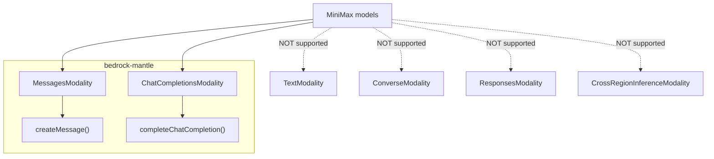
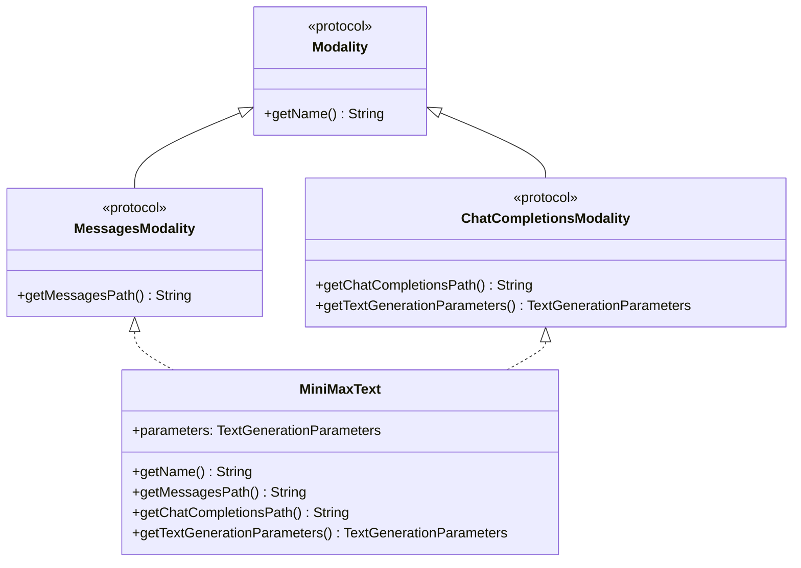

# Design Document: MiniMax Model Support

## Overview

This design adds three MiniMax models to the Swift Bedrock Library. All three models use both the Anthropic Messages API format and the Chat Completions API format, routing through the bedrock-mantle endpoint. The implementation conforms to both `MessagesModality` and `ChatCompletionsModality`, reusing the existing `createMessage` and `completeChatCompletion` infrastructure.

**Models:**
- `minimax_m2` — MiniMax M2, 1M token context, 8K max output
- `minimax_m2_1` — MiniMax M2.1, 196K token context, 8K max output
- `minimax_m2_5` — MiniMax M2.5, 196K token context, 8K max output

The implementation introduces:
1. A new `Sources/BedrockService/Models/MiniMax/` provider directory
2. A `MiniMaxText` modality struct conforming to both `MessagesModality` and `ChatCompletionsModality`
3. Three `BedrockModel` static constants
4. Two example projects: `Examples/minimax-messages/` and `Examples/minimax-chatcompletions/`

No new protocols, service methods, or request/response types are needed — MiniMax models plug directly into the existing Messages and Chat Completions infrastructure.

## Architecture

### Endpoint Routing



### Modality Struct Design



### Key Architectural Decisions

1. **MessagesModality + ChatCompletionsModality**: MiniMax models conform to both protocols. This means they can be used with both `createMessage` (Anthropic Messages format) and `completeChatCompletion` (OpenAI Chat Completions format). This is similar to how xAI Grok conforms to `ChatCompletionsModality + ResponsesModality`, but MiniMax uses `MessagesModality + ChatCompletionsModality` instead.

2. **Reuses all existing infrastructure**: The `createMessage` method already handles `MessagesModality` models by building `MessagesRequestBody`, sending to bedrock-mantle at the path returned by `getMessagesPath()`, and decoding `MessagesOutput`. Similarly, `completeChatCompletion` handles `ChatCompletionsModality` models by building `ChatCompletionsRequestBody`, sending to bedrock-mantle at the path returned by `getChatCompletionsPath()`, and decoding `ChatCompletionsOutput`. MiniMax plugs directly into both.

3. **No cross-region inference**: MiniMax models are in-region only. The `MiniMaxText` struct does NOT conform to `CrossRegionInferenceModality` or `GlobalCrossRegionInferenceModality`, so `getModelIdWithCrossRegionInferencePrefix` returns the plain model ID.

4. **Parameter structure**: All three models share identical parameter ranges. The `TextGenerationParameters` struct captures temperature [0, 1], maxTokens [1, 8192], topP [0, 1], topK not supported, stopSequences not supported.

5. **Pattern follows xAI Grok**: The file structure (modality struct + BedrockModels file) mirrors the xAI directory. The dual-protocol conformance mirrors how `GrokText` conforms to `ChatCompletionsModality + ResponsesModality`, but `MiniMaxText` conforms to `MessagesModality + ChatCompletionsModality`.

## Components and Interfaces

### New Files

| File | Purpose |
|------|---------|
| `Sources/BedrockService/Models/MiniMax/MiniMax.swift` | `MiniMaxText` modality struct |
| `Sources/BedrockService/Models/MiniMax/MiniMaxBedrockModels.swift` | Three `BedrockModel` static constants |
| `Examples/minimax-messages/Package.swift` | Messages example package manifest |
| `Examples/minimax-messages/Sources/MiniMaxMessages.swift` | Example demonstrating `createMessage` with MiniMax |
| `Examples/minimax-chatcompletions/Package.swift` | Chat Completions example package manifest |
| `Examples/minimax-chatcompletions/Sources/MiniMaxChatCompletions.swift` | Example demonstrating `completeChatCompletion` with MiniMax |

### Modified Files

| File | Change |
|------|--------|
| `Sources/BedrockService/Models/BedrockModel.swift` | Add three new cases in `init?(rawValue:)` |
| `.github/workflows/pull_request.yml` | Add `'minimax-messages'` and `'minimax-chatcompletions'` to examples list |

### `MiniMaxText` Struct

```swift
struct MiniMaxText: MessagesModality, ChatCompletionsModality {
    let parameters: TextGenerationParameters

    func getName() -> String { "MiniMax Text Generation" }
    func getMessagesPath() -> String { "/anthropic/v1/messages" }
    func getChatCompletionsPath() -> String { "/v1/chat/completions" }
    func getTextGenerationParameters() -> TextGenerationParameters { parameters }
}
```

This struct conforms to both `MessagesModality` and `ChatCompletionsModality`. It provides paths for both the Anthropic Messages API and the OpenAI Chat Completions API endpoints, and exposes `TextGenerationParameters` as required by `ChatCompletionsModality`.

### `BedrockModel` Static Constants

```swift
extension BedrockModel {
    public static let minimax_m2: BedrockModel = BedrockModel(
        id: "minimax.minimax-m2",
        name: "MiniMax M2",
        modality: MiniMaxText(
            parameters: TextGenerationParameters(
                temperature: Parameter(.temperature, minValue: 0, maxValue: 1, defaultValue: 1),
                maxTokens: Parameter(.maxTokens, minValue: 1, maxValue: 8192, defaultValue: 8192),
                topP: Parameter(.topP, minValue: 0, maxValue: 1, defaultValue: 1),
                topK: Parameter.notSupported(.topK),
                stopSequences: StopSequenceParams.notSupported(),
                maxPromptSize: nil
            )
        )
    )

    public static let minimax_m2_1: BedrockModel = BedrockModel(
        id: "minimax.minimax-m2.1",
        name: "MiniMax M2.1",
        modality: MiniMaxText(
            parameters: TextGenerationParameters(
                temperature: Parameter(.temperature, minValue: 0, maxValue: 1, defaultValue: 1),
                maxTokens: Parameter(.maxTokens, minValue: 1, maxValue: 8192, defaultValue: 8192),
                topP: Parameter(.topP, minValue: 0, maxValue: 1, defaultValue: 1),
                topK: Parameter.notSupported(.topK),
                stopSequences: StopSequenceParams.notSupported(),
                maxPromptSize: nil
            )
        )
    )

    public static let minimax_m2_5: BedrockModel = BedrockModel(
        id: "minimax.minimax-m2.5",
        name: "MiniMax M2.5",
        modality: MiniMaxText(
            parameters: TextGenerationParameters(
                temperature: Parameter(.temperature, minValue: 0, maxValue: 1, defaultValue: 1),
                maxTokens: Parameter(.maxTokens, minValue: 1, maxValue: 8192, defaultValue: 8192),
                topP: Parameter(.topP, minValue: 0, maxValue: 1, defaultValue: 1),
                topK: Parameter.notSupported(.topK),
                stopSequences: StopSequenceParams.notSupported(),
                maxPromptSize: nil
            )
        )
    )
}
```

### `BedrockModel.init?(rawValue:)` Additions

```swift
// minimax
case BedrockModel.minimax_m2.id: self = BedrockModel.minimax_m2
case BedrockModel.minimax_m2_1.id: self = BedrockModel.minimax_m2_1
case BedrockModel.minimax_m2_5.id: self = BedrockModel.minimax_m2_5
```

### Protocol Conformance Summary

| Check | MiniMax (all 3) |
|-------|-----------------|
| `hasMessagesModality()` | `true` |
| `hasChatCompletionsModality()` | `true` |
| `hasTextModality()` | `false` |
| `hasConverseModality()` | `false` |
| `hasResponsesModality()` | `false` |
| `hasImageModality()` | `false` |

## Data Models

### Text Generation Parameters

All three models share identical parameter ranges:

| Parameter | Min | Max | Default | Supported |
|-----------|-----|-----|---------|-----------|
| temperature | 0 | 1 | 1 | Yes |
| maxTokens | 1 | 8192 | 8192 | Yes |
| topP | 0 | 1 | 1 | Yes |
| topK | — | — | — | No |
| stopSequences | — | — | — | No |

### Model Identifiers

| Model | ID | Name | Messages Path | Chat Completions Path |
|-------|-----|------|---------------|-----------------------|
| MiniMax M2 | `minimax.minimax-m2` | MiniMax M2 | `/anthropic/v1/messages` | `/v1/chat/completions` |
| MiniMax M2.1 | `minimax.minimax-m2.1` | MiniMax M2.1 | `/anthropic/v1/messages` | `/v1/chat/completions` |
| MiniMax M2.5 | `minimax.minimax-m2.5` | MiniMax M2.5 | `/anthropic/v1/messages` | `/v1/chat/completions` |

### Wire Format — Messages API (Existing — No Changes Needed)

MiniMax models use the existing `MessagesRequestBody` and `MessagesOutput` types already defined for Claude Fable 5.

**Request** (existing `MessagesRequestBody`):
```json
{
  "model": "minimax.minimax-m2",
  "max_tokens": 8192,
  "messages": [{"role": "user", "content": "Hello"}]
}
```

**Response** (existing `MessagesRawOutput` → `MessagesOutput`):
```json
{
  "id": "msg_abc123",
  "type": "message",
  "role": "assistant",
  "content": [{"type": "text", "text": "Generated text here"}],
  "model": "minimax.minimax-m2",
  "usage": {"input_tokens": 10, "output_tokens": 20}
}
```

### Wire Format — Chat Completions API (Existing — No Changes Needed)

MiniMax models use the existing `ChatCompletionsRequestBody` and `ChatCompletionsOutput` types.

**Request** (existing `ChatCompletionsRequestBody`):
```json
{
  "model": "minimax.minimax-m2",
  "max_tokens": 8192,
  "messages": [{"role": "user", "content": "Hello"}]
}
```

**Response** (existing `ChatCompletionsOutput`):
```json
{
  "id": "chatcmpl-abc123",
  "object": "chat.completion",
  "choices": [{"index": 0, "message": {"role": "assistant", "content": "Generated text here"}}],
  "usage": {"prompt_tokens": 10, "completion_tokens": 20, "total_tokens": 30}
}
```

## Correctness Properties

### Property 1: Unknown raw values resolve to nil

*For any* string that does not match any known model ID in the library, `BedrockModel(rawValue:)` SHALL return nil.

**Validates: Requirements 1.6**

### Property 2: MiniMax models resolve from rawValue round-trip

*For any* of the three MiniMax model IDs (`minimax.minimax-m2`, `minimax.minimax-m2.1`, `minimax.minimax-m2.5`), constructing a `BedrockModel` via `init?(rawValue:)` SHALL return a non-nil instance whose `id` property equals the original raw value string.

**Validates: Requirements 1.5, 2.4, 3.4**

### Property 3: MiniMax models have consistent messages path

*For any* of the three MiniMax models, calling `getMessagesModality()` SHALL succeed and the returned modality's `getMessagesPath()` SHALL always equal `/anthropic/v1/messages`.

**Validates: Requirements 1.3, 2.2, 3.2, 6.1**

### Property 4: MiniMax models have consistent chat completions path

*For any* of the three MiniMax models, calling `getChatCompletionsModality()` SHALL succeed and the returned modality's `getChatCompletionsPath()` SHALL always equal `/v1/chat/completions`.

**Validates: Requirements 1.4, 2.3, 3.3, 7.1**

### Property 5: MiniMax models do not have unsupported modalities

*For any* of the three MiniMax models, `hasTextModality()`, `hasConverseModality()`, `hasResponsesModality()`, and `hasImageModality()` SHALL all return false.

**Validates: Requirements 5.3, 5.4, 5.5, 5.6**

### Property 6: Cross-region inference returns plain model ID

*For any* of the three MiniMax models and *for any* valid AWS region, `getModelIdWithCrossRegionInferencePrefix(region:)` SHALL return the model ID without any prefix (equal to the model's `id` property).

**Validates: Requirements 8.1, 8.2**

## Error Handling

| Scenario | Error | Message |
|----------|-------|---------|
| `getTextModality()` on MiniMax model | `BedrockLibraryError.invalidModality` | "Model {id} does not support text generation" |
| `getConverseModality()` on MiniMax model | `BedrockLibraryError.invalidModality` | "Model {id} does not support text generation" |
| `getResponsesModality()` on MiniMax model | `BedrockLibraryError.invalidModality` | "Model {id} does not support the Responses API" |
| `getImageModality()` on MiniMax model | `BedrockLibraryError.invalidModality` | "Model {id} does not support image generation" |
| `createMessage` with model lacking MessagesModality | `BedrockLibraryError.invalidModality` | "Model {id} does not support the Messages API" |
| `completeChatCompletion` with model lacking ChatCompletionsModality | `BedrockLibraryError.invalidModality` | "Model {id} does not support the Chat Completions API" |

## Testing Strategy

### Test Framework

All tests use Swift Testing (`@Suite`, `@Test`, `#expect`, `#require`) as per project conventions. Run with `swift test`.

### Unit Tests (Example-Based)

Organized in `Tests/Messages/MiniMaxMessagesModelTests.swift`:

Coverage:
- All 3 model constants (ID, name)
- `hasMessagesModality()` returns true for all 3
- `hasChatCompletionsModality()` returns true for all 3
- `hasTextModality()` returns false for all 3
- `hasConverseModality()` returns false for all 3
- `hasResponsesModality()` returns false for all 3
- `hasImageModality()` returns false for all 3
- Messages path value (`/anthropic/v1/messages`) for all 3
- Chat Completions path value (`/v1/chat/completions`) for all 3
- Raw value initialization for all 3 models
- Unknown raw value → nil
- Error throws for unsupported modality access (`getTextModality`, `getConverseModality`, `getResponsesModality`)
- Cross-region inference returns plain ID (no prefix)

### Integration Tests (with Mocks)

Using existing mock clients:

- `createMessage` with MiniMax M2 model → correct response (using `MockBedrockMantleMessagesClient`)
- `createMessage` with MiniMax M2.5 model → correct response
- `completeChatCompletion` with MiniMax M2 model → correct response (using `MockBedrockMantleChatCompletionsClient`)
- `createMessage` throws `invalidModality` for models without MessagesModality
- `completeChatCompletion` throws `invalidModality` for models without ChatCompletionsModality

### Property-Based Tests

Using Swift Testing's `@Test(..., arguments:)` with generated value arrays:

| Property | Test Location | Strategy |
|----------|--------------|----------|
| 1: Unknown raw values → nil | `MiniMaxMessagesModelTests` | Generate 100 random UUID strings, verify all return nil from `BedrockModel(rawValue:)` |
| 2: rawValue round-trip | `MiniMaxMessagesModelTests` | Verify all 3 MiniMax model IDs resolve correctly |
| 3: Consistent messages path | `MiniMaxMessagesModelTests` | Verify all 3 models return `/anthropic/v1/messages` |
| 4: Consistent chat completions path | `MiniMaxMessagesModelTests` | Verify all 3 models return `/v1/chat/completions` |
| 5: No unsupported modalities | `MiniMaxMessagesModelTests` | Verify all 4 unsupported modality checks return false for all 3 models |
| 6: Plain model ID for cross-region | `MiniMaxMessagesModelTests` | Verify all 3 models across multiple regions return plain ID |
