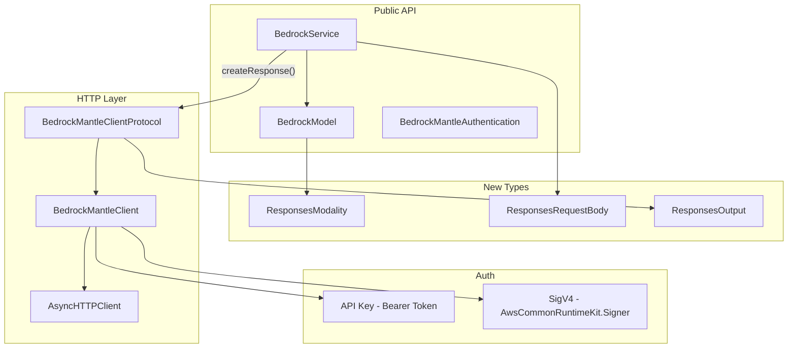

# Design Document: OpenAI Responses API (Bedrock-Mantle)

## Overview

This feature adds support for the OpenAI Responses API on the `bedrock-mantle` endpoint. This enables:
- **New models**: GPT 5.5 and GPT 5.4 (Responses API only — no Invoke/Converse/ChatCompletions)
- **Existing models via mantle**: gpt-oss-120b and gpt-oss-20b already support Invoke+Converse, and we now also expose them via the Responses API

The implementation introduces:
1. **ResponsesModality protocol** — marks models that support the Responses API
2. **BedrockMantleClient** — HTTP client for the bedrock-mantle endpoint using `AsyncHTTPClient`
3. **Dual authentication** — API key (Bearer token) and SigV4 signing
4. **BedrockService.createResponse()** — public API on the existing service struct

## Architecture



## Key Design Decisions

### 1. Why AsyncHTTPClient (not URLSession)?

- Already a transitive dependency via aws-sdk-swift — no new dependencies
- Server-side Swift compatible (works on Linux)
- Non-blocking, built on SwiftNIO
- The project targets macOS 15+ AND Linux (CI runs on Amazon Linux 2023)

### 2. Why not the MacPaw/OpenAI library?

- Adds `swift-openapi-runtime` as a transitive dependency
- Overkill — we only need a single POST endpoint
- Would couple the library to an external community project

### 3. Path routing by model

GPT 5.5/5.4 use `/openai/v1/responses` while gpt-oss models use `/v1/responses`. The path is stored in the `OpenAIResponses` modality struct and retrieved via `getResponsesPath()`. This lets us support both variants without conditional logic in the client.

### 4. Authentication design

```swift
public enum BedrockMantleAuthentication: Sendable {
    case apiKey(String)
    case sigV4
}
```

- **API key**: Simple Bearer token in the `Authorization` header. User creates key in the Bedrock console.
- **SigV4**: Uses the CRT Signer with existing AWS credentials. Service name is `bedrock`, region from BedrockService.

### 5. No streaming (initial scope)

The Responses API supports `"stream": true` but we defer streaming to a follow-up. The initial implementation is synchronous request/response only.

## Endpoint Details

| Property | Value |
|---|---|
| Base URL | `https://bedrock-mantle.{region}.api.aws` |
| Method | POST |
| Path (GPT 5.5/5.4) | `/openai/v1/responses` |
| Path (gpt-oss) | `/v1/responses` |
| Content-Type | `application/json` |
| Auth (API key) | `Authorization: Bearer {key}` |
| Auth (SigV4) | Standard AWS SigV4 signing (service: `bedrock`) |

## Request Format

```json
{
    "model": "openai.gpt-5.5",
    "input": [
        {"role": "user", "content": "Hello! How can you help me today?"}
    ],
    "store": false
}
```

## Response Format (simplified)

```json
{
    "id": "resp_abc123",
    "object": "response",
    "model": "openai.gpt-5.5",
    "output": [
        {
            "type": "message",
            "role": "assistant",
            "content": [
                {"type": "output_text", "text": "Hello! I can help you with..."}
            ]
        }
    ],
    "usage": {
        "input_tokens": 10,
        "output_tokens": 25,
        "total_tokens": 35
    }
}
```

## Models Supporting the Responses API

| Model | Model ID | Responses Path | Also supports Invoke/Converse | Status |
|---|---|---|---|---|
| GPT 5.5 | `openai.gpt-5.5` | `/openai/v1/responses` | No | **New model** |
| GPT 5.4 | `openai.gpt-5.4` | `/openai/v1/responses` | No | **New model** |
| gpt-oss-120b | `openai.gpt-oss-120b-1:0` | `/v1/responses` | Yes (already in library) | **Add ResponsesModality** |
| gpt-oss-20b | `openai.gpt-oss-20b-1:0` | `/v1/responses` | Yes (already in library) | **Add ResponsesModality** |

### New Model Specs

| | GPT 5.5 | GPT 5.4 |
|---|---|---|
| Model ID | `openai.gpt-5.5` | `openai.gpt-5.4` |
| Context window | 272K tokens | 272K tokens |
| Input modalities | Text, Image | Text, Image |
| Output modalities | Text | Text |
| Cross-region | Not supported | Not supported |
| Service tiers | Standard only | Standard only |
| Regions | us-east-2 | us-east-2, us-west-2 |

### Existing Model Changes

The existing `OpenAIText` struct (used by gpt-oss-20b and gpt-oss-120b) will additionally conform to `ResponsesModality`, returning path `/v1/responses`. This means these models keep their current Invoke+Converse capabilities AND gain Responses API support.

## Bedrock-Mantle Supported Regions

us-east-1, us-east-2, us-west-2, ap-southeast-3, ap-south-1, ap-southeast-2, ap-northeast-1, eu-central-1, eu-west-1, eu-west-2, eu-south-1, eu-north-1, sa-east-1

## File Structure

```
Sources/BedrockService/
├── BedrockRuntimeClient/
│   ├── Modalities/
│   │   └── ResponsesModality.swift          (NEW)
│   └── Responses/
│       ├── BedrockMantleAuthentication.swift (NEW)
│       ├── BedrockMantleClientProtocol.swift (NEW)
│       ├── BedrockMantleClient.swift         (NEW)
│       ├── ResponsesInput.swift             (NEW)
│       ├── ResponsesOutput.swift            (NEW)
│       └── BedrockService+Responses.swift   (NEW)
└── Models/
    └── OpenAI/
        ├── OpenAI.swift                     (MODIFIED - add ResponsesModality conformance)
        ├── OpenAIBedrockModels.swift        (MODIFIED - add GPT 5.5/5.4)
        └── OpenAIResponses.swift            (NEW - responses-only modality for GPT 5.5/5.4)

Tests/
├── Responses/
│   ├── ResponsesModelTests.swift            (NEW)
│   ├── ResponsesRequestTests.swift          (NEW)
│   ├── ResponsesResponseTests.swift         (NEW)
│   └── ResponsesServiceTests.swift          (NEW)
└── Mock/
    └── MockBedrockMantleClient.swift        (NEW)

Examples/
└── responses/
    ├── Package.swift                        (NEW)
    └── Sources/
        └── Responses.swift                  (NEW)
```
