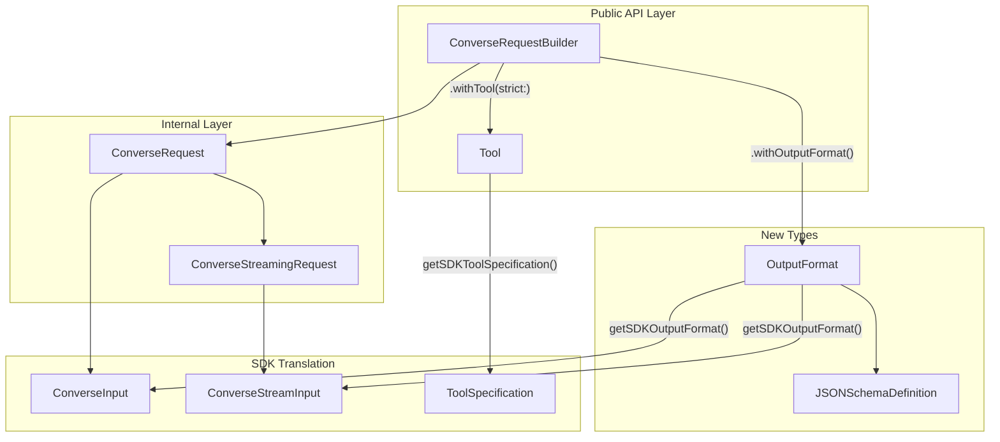
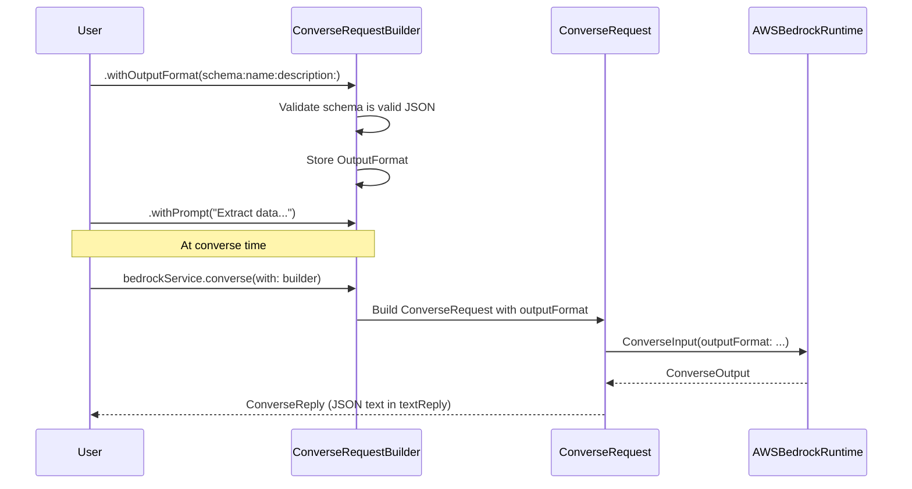
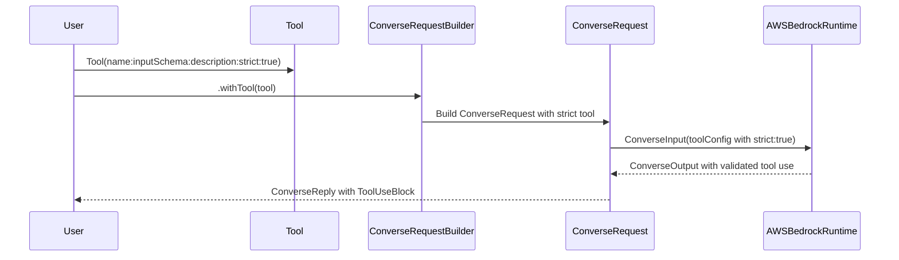

# Design Document: Structured Output

## Overview

This feature adds support for Amazon Bedrock's structured output capability to the Swift Bedrock Library. Structured outputs use constrained decoding to guarantee model responses conform to a specified JSON schema, enabling reliable machine-readable responses.

The feature introduces two mechanisms:
1. **JSON Schema output format** — Controls the model's response format via `outputConfig.textFormat` in the Converse API, forcing the model to produce JSON conforming to a user-defined schema.
2. **Strict tool use** — Validates tool input parameters against their schema by adding `strict: true` to tool definitions, ensuring tool calls always produce valid inputs.

Both mechanisms integrate into the existing `ConverseRequestBuilder` fluent API pattern, maintaining consistency with the library's current design philosophy.

## Architecture



## Sequence Diagrams

### JSON Schema Output Format Flow



### Strict Tool Use Flow



## Components and Interfaces

### Component 1: OutputFormat

**Purpose**: Represents the structured output configuration for the Converse API. Encapsulates the JSON schema definition that constrains model output.

```swift
public struct OutputFormat: Codable, Sendable {
    public let schema: JSON
    public let name: String
    public let description: String?

    public init(schema: JSON, name: String, description: String? = nil) throws
    public init(schema: String, name: String, description: String? = nil) throws
    public init<T: Encodable>(from type: T.Type, name: String, description: String? = nil) throws

    func getSDKOutputFormat() throws -> BedrockRuntimeClientTypes.OutputFormat
}
```

**Responsibilities**:
- Validate that the provided schema is valid JSON
- Validate that the name is non-empty and conforms to naming rules
- Convert to the SDK's `OutputFormat` type for API calls
- Provide convenience initializers for common use cases (JSON string, `JSON` type, Encodable type)

### Component 2: Tool (Extended)

**Purpose**: Extends the existing `Tool` struct to support the `strict` parameter for constrained tool input validation.

```swift
public struct Tool: Codable, CustomStringConvertible, Sendable {
    public let name: String
    public let inputSchema: JSON
    public let toolDescription: String?
    public let strict: Bool  // NEW

    public init(name: String, inputSchema: JSON, description: String? = nil, strict: Bool = false) throws
    public func getSDKToolSpecification() throws -> BedrockRuntimeClientTypes.ToolSpecification
}
```

**Responsibilities**:
- Store the `strict` flag alongside existing tool properties
- Pass `strict: true` through to the SDK's `ToolSpecification` when generating the SDK type
- Default to `strict: false` for backward compatibility

### Component 3: ConverseRequestBuilder (Extended)

**Purpose**: Extends the builder with methods to configure structured output.

```swift
extension ConverseRequestBuilder {
    public func withOutputFormat(_ outputFormat: OutputFormat) throws -> ConverseRequestBuilder
    public func withOutputFormat(schema: JSON, name: String, description: String? = nil) throws -> ConverseRequestBuilder
    public func withOutputFormat(schema: String, name: String, description: String? = nil) throws -> ConverseRequestBuilder
}
```

**Responsibilities**:
- Validate that the model supports structured output (via `ConverseFeature`)
- Store the output format configuration
- Pass it through to `ConverseRequest` at build time

### Component 4: ConverseRequest (Extended)

**Purpose**: Extends the internal request struct to include output format in the SDK input.

```swift
struct ConverseRequest {
    // ... existing fields ...
    let outputFormat: OutputFormat?  // NEW

    func getConverseInput(forRegion region: Region) throws -> ConverseInput
}
```

**Responsibilities**:
- Include `outputFormat` in the `ConverseInput` construction
- Include `outputFormat` in the `ConverseStreamInput` construction (via the streaming extension)

## Data Models

### OutputFormat

```swift
public struct OutputFormat: Codable, Sendable {
    /// The JSON schema that constrains the model's output
    public let schema: JSON
    /// A name identifying this schema (used for caching)
    public let name: String
    /// An optional description of what the schema represents
    public let description: String?
}
```

**Validation Rules**:
- `schema` must be valid JSON representing a JSON Schema object
- `name` must be non-empty
- `name` must match pattern `[a-zA-Z0-9_-]+`
- The schema's root must be an object type (Bedrock requirement)

### ConverseFeature (Extended)

```swift
public enum ConverseFeature: String, Codable, Sendable {
    case textGeneration = "text-generation"
    case vision = "vision"
    case document = "document"
    case toolUse = "tool-use"
    case systemPrompts = "system-prompts"
    case reasoning = "reasoning"
    case structuredOutput = "structured-output"  // NEW
}
```

### SDK Mapping

The `OutputFormat` maps to the Bedrock API structure:

```swift
// SDK type hierarchy:
// ConverseInput.outputFormat -> BedrockRuntimeClientTypes.OutputFormat
//   .type = "json_schema"
//   .structure -> BedrockRuntimeClientTypes.OutputFormatStructure
//     .jsonSchema -> BedrockRuntimeClientTypes.JsonSchemaDefinition
//       .schema = "<json_string>"
//       .name = "schema_name"
//       .description = "optional description"
```

## Algorithmic Pseudocode

### OutputFormat SDK Conversion

```swift
func getSDKOutputFormat() throws -> BedrockRuntimeClientTypes.OutputFormat {
    // PRECONDITION: schema is valid JSON, name is non-empty
    // POSTCONDITION: Returns a valid SDK OutputFormat ready for API call

    let schemaString = try schema.toJSONString()

    let jsonSchemaDefinition = BedrockRuntimeClientTypes.JsonSchemaDefinition(
        description: self.description,
        name: self.name,
        schema: schemaString
    )

    let structure = BedrockRuntimeClientTypes.OutputFormatStructure.jsonSchema(jsonSchemaDefinition)

    return BedrockRuntimeClientTypes.OutputFormat(
        structure: structure,
        type: .jsonSchema
    )
}
```

**Preconditions:**
- `schema` contains valid JSON that represents a JSON Schema
- `name` is non-empty and matches `[a-zA-Z0-9_-]+`

**Postconditions:**
- Returns a fully populated `BedrockRuntimeClientTypes.OutputFormat`
- The `type` field is always `.jsonSchema`
- The `schema` field in the definition is a JSON string representation

### Tool SDK Conversion (Updated)

```swift
func getSDKToolSpecification() throws -> BedrockRuntimeClientTypes.ToolSpecification {
    // PRECONDITION: name is valid, inputSchema is valid JSON
    // POSTCONDITION: Returns ToolSpecification with strict flag when set

    return BedrockRuntimeClientTypes.ToolSpecification(
        description: toolDescription,
        inputSchema: .json(try inputSchema.toDocument()),
        name: name,
        strict: strict ? true : nil  // Only pass when true
    )
}
```

**Preconditions:**
- `name` is non-empty and matches `[a-zA-Z0-9_-]+`
- `inputSchema` is valid JSON convertible to a Smithy Document

**Postconditions:**
- Returns `ToolSpecification` with `strict` set to `true` when enabled
- When `strict` is `false`, `strict` is passed as `nil` (omitted from request)

### ConverseInput Construction (Updated)

```swift
func getConverseInput(forRegion region: Region) throws -> ConverseInput {
    // PRECONDITION: All request fields are validated
    // POSTCONDITION: Returns complete ConverseInput with outputFormat when set

    return ConverseInput(
        additionalModelRequestFields: try getAdditionalModelRequestFields(),
        inferenceConfig: inferenceConfig?.getSDKInferenceConfig(),
        messages: try getSDKMessages(),
        modelId: model.getModelIdWithCrossRegionInferencePrefix(region: region),
        outputFormat: try outputFormat?.getSDKOutputFormat(),  // NEW
        serviceTier: BedrockRuntimeClientTypes.ServiceTier(type: .init(rawValue: serviceTier.rawValue)),
        system: getSDKSystemPrompts(),
        toolConfig: try toolConfig?.getSDKToolConfig()
    )
}
```

**Preconditions:**
- Model ID is valid
- Messages are properly formatted
- OutputFormat (if set) has been validated

**Postconditions:**
- Returns `ConverseInput` with all fields populated
- `outputFormat` is included only when explicitly configured
- All other existing fields remain unchanged

### Builder withOutputFormat Validation

```swift
func withOutputFormat(_ outputFormat: OutputFormat) throws -> ConverseRequestBuilder {
    // PRECONDITION: outputFormat is a valid OutputFormat instance
    // POSTCONDITION: Returns new builder with outputFormat set

    try validateFeature(.structuredOutput)

    var copy = self
    copy.outputFormat = outputFormat
    return copy
}
```

**Preconditions:**
- The model supports the `.structuredOutput` converse feature
- `outputFormat` has been constructed with valid schema and name

**Postconditions:**
- Returns a new builder instance with `outputFormat` stored
- Original builder is unchanged (value semantics)

## Key Functions with Formal Specifications

### OutputFormat.init(schema:name:description:)

```swift
public init(schema: JSON, name: String, description: String? = nil) throws
```

**Preconditions:**
- `schema` is a valid `JSON` value (not `.null`)
- `name` is non-empty
- `name` matches regex `[a-zA-Z0-9_-]+`

**Postconditions:**
- Returns a valid `OutputFormat` instance
- Throws `BedrockLibraryError.invalidName` if name is empty or invalid
- Throws `BedrockLibraryError.invalid` if schema is null

**Loop Invariants:** N/A

### OutputFormat.init(schema:name:description:) (String variant)

```swift
public init(schema: String, name: String, description: String? = nil) throws
```

**Preconditions:**
- `schema` is a valid JSON string
- `name` is non-empty and matches `[a-zA-Z0-9_-]+`

**Postconditions:**
- Returns a valid `OutputFormat` instance with parsed JSON schema
- Throws `BedrockLibraryError.decodingError` if schema string is not valid JSON
- Throws `BedrockLibraryError.invalidName` if name is invalid

**Loop Invariants:** N/A

### Tool.init(name:inputSchema:description:strict:)

```swift
public init(name: String, inputSchema: JSON, description: String? = nil, strict: Bool = false) throws
```

**Preconditions:**
- `name` is non-empty
- `name` matches `[a-zA-Z0-9_-]+`
- `inputSchema` is valid JSON

**Postconditions:**
- Returns a `Tool` with `strict` property set
- Backward compatible: existing callers without `strict` parameter get `false`
- Throws same errors as current implementation for invalid name

**Loop Invariants:** N/A

### ConverseRequestBuilder.withOutputFormat(_:)

```swift
public func withOutputFormat(_ outputFormat: OutputFormat) throws -> ConverseRequestBuilder
```

**Preconditions:**
- Model supports `.structuredOutput` feature
- `outputFormat` is a valid instance

**Postconditions:**
- Returns new builder with `outputFormat` stored
- Throws `BedrockLibraryError.invalidModality` if model doesn't support structured output
- Original builder is unchanged

**Loop Invariants:** N/A

## Example Usage

```swift
// Example 1: JSON Schema output format with builder pattern
let schema = try JSON(from: """
{
    "type": "object",
    "properties": {
        "name": { "type": "string" },
        "age": { "type": "integer" },
        "email": { "type": "string", "format": "email" }
    },
    "required": ["name", "age", "email"],
    "additionalProperties": false
}
""")

let builder = try ConverseRequestBuilder(with: .claude3_5_sonnet)
    .withPrompt("Extract the person's info from: John Doe, 30 years old, john@example.com")
    .withOutputFormat(schema: schema, name: "person_info", description: "Person information")

let reply = try await bedrockService.converse(with: builder)
let jsonText = try reply.getTextReply()  // Guaranteed valid JSON matching schema

// Example 2: Strict tool use
let tool = try Tool(
    name: "get_weather",
    inputSchema: try JSON(from: """
    {
        "type": "object",
        "properties": {
            "location": { "type": "string" },
            "unit": { "type": "string", "enum": ["celsius", "fahrenheit"] }
        },
        "required": ["location", "unit"],
        "additionalProperties": false
    }
    """),
    description: "Get weather for a location",
    strict: true
)

let builder = try ConverseRequestBuilder(with: .claude3_5_sonnet)
    .withPrompt("What's the weather in Paris?")
    .withTool(tool)

let reply = try await bedrockService.converse(with: builder)
let toolUse = try reply.getToolUse()  // Tool input guaranteed to match schema

// Example 3: Using OutputFormat directly
let outputFormat = try OutputFormat(
    schema: schema,
    name: "extraction_result",
    description: "Structured extraction result"
)

let builder = try ConverseRequestBuilder(with: .claude3_5_sonnet)
    .withPrompt("Analyze this text...")
    .withOutputFormat(outputFormat)

// Example 4: Streaming with structured output
let builder = try ConverseRequestBuilder(with: .claude3_5_sonnet)
    .withPrompt("List 3 books as JSON")
    .withOutputFormat(schema: bookListSchema, name: "book_list")

let stream = try await bedrockService.converseStream(with: builder)
for try await element in stream.stream {
    switch element {
    case .text(let delta):
        print(delta, terminator: "")  // Partial JSON streamed
    case .messageComplete(let message):
        // Full message available, text is valid JSON
        break
    default:
        break
    }
}

// Example 5: Checking stop reason for conformance
let reply = try await bedrockService.converse(with: builder)
let lastMessage = reply.getLastMessage()
if lastMessage.stopReason == .endTurn {
    // Response conforms to schema
    let json = try reply.getTextReply()
} else if lastMessage.stopReason == .maxTokens {
    // Response may be truncated and not conform to schema
    // Handle gracefully
}
```

## Correctness Properties

*A property is a characteristic or behavior that should hold true across all valid executions of a system-essentially, a formal statement about what the system should do. Properties serve as the bridge between human-readable specifications and machine-verifiable correctness guarantees.*

### Property 1: Backward Compatibility

*For any* existing code using `Tool(name:inputSchema:description:)`, the behavior is unchanged — `strict` defaults to `false` and is omitted from the SDK request.

**Validates: Requirements 3.2, 3.4, 3.5**

### Property 2: Schema Preservation

*For any* valid JSON schema `s` and valid name `n`, creating `OutputFormat(schema: s, name: n)` and calling `getSDKOutputFormat()` SHALL produce a JsonSchemaDefinition whose schema field, when parsed back to JSON, is semantically equivalent to `s`.

**Validates: Requirements 1.2, 1.3, 2.2**

### Property 3: Name Validation Consistency

*For any* string `s`, the OutputFormat name validation and Tool name validation SHALL produce the same accept/reject result — both use the pattern `[a-zA-Z0-9_-]+` and reject empty strings.

**Validates: Requirements 7.1, 7.2**

### Property 4: Feature Gating

*For any* model `m` where `m.hasConverseModality(.structuredOutput) == false`, calling `withOutputFormat()` on a builder for that model SHALL throw `BedrockLibraryError.invalidModality`.

**Validates: Requirements 4.5, 6.2, 6.3**

### Property 5: Nil Propagation

*For any* ConverseRequest where `outputFormat` is nil, the `outputFormat` field in the resulting `ConverseInput` (and `ConverseStreamInput` for streaming) SHALL be nil.

**Validates: Requirements 5.2, 5.3**

### Property 6: Strict Tool Mapping

*For any* Tool with `strict == true`, `getSDKToolSpecification().strict` SHALL be `true`. *For any* Tool with `strict == false`, `getSDKToolSpecification().strict` SHALL be `nil`.

**Validates: Requirements 3.3, 3.4**

### Property 7: Immutable Builder

*For any* builder `b` and valid OutputFormat `f`, calling `b.withOutputFormat(f)` SHALL return a new builder with the format set, and `b` SHALL remain unchanged (no outputFormat stored).

**Validates: Requirements 4.6, 4.7**

## Error Handling

### Error Scenario 1: Invalid Schema JSON

**Condition**: User provides a malformed JSON string to `OutputFormat.init(schema: String, ...)`
**Response**: Throws `BedrockLibraryError.decodingError("Failed to decode JSON: ...")`
**Recovery**: User fixes the JSON string and retries

### Error Scenario 2: Unsupported Model

**Condition**: User calls `withOutputFormat()` on a model that doesn't support structured output
**Response**: Throws `BedrockLibraryError.invalidModality(model, modality, "This model does not support converse feature structuredOutput.")`
**Recovery**: User selects a supported model

### Error Scenario 3: Empty or Invalid Name

**Condition**: User provides empty string or invalid characters for schema name
**Response**: Throws `BedrockLibraryError.invalidName("OutputFormat name is not allowed to be empty")` or `BedrockLibraryError.invalidName("OutputFormat name must consist of only...")`
**Recovery**: User provides a valid name

### Error Scenario 4: Non-Conforming Response (Runtime)

**Condition**: Model returns a response that doesn't conform to schema (e.g., due to `maxTokens` truncation or content filtering)
**Response**: The library returns the response as-is. The `stopReason` on the message indicates why the response may not conform (`.maxTokens`, `.contentFiltered`, `.guardrailIntervened`).
**Recovery**: User checks `stopReason` before parsing the JSON response. Only `.endTurn` guarantees conformance.

### Error Scenario 5: Null Schema

**Condition**: User provides a `.null` JSON value as schema
**Response**: Throws `BedrockLibraryError.invalid("OutputFormat schema must not be null")`
**Recovery**: User provides a valid JSON schema object

## Testing Strategy

### Unit Testing Approach

- Test `OutputFormat` initialization with valid and invalid inputs
- Test `OutputFormat.getSDKOutputFormat()` produces correct SDK types
- Test `Tool` with `strict: true` produces correct `ToolSpecification`
- Test `Tool` with `strict: false` (default) omits strict from `ToolSpecification`
- Test `ConverseRequestBuilder.withOutputFormat()` stores the format correctly
- Test `ConverseRequestBuilder.withOutputFormat()` throws for unsupported models
- Test `ConverseRequest.getConverseInput()` includes `outputFormat` when set
- Test `ConverseRequest.getConverseInput()` excludes `outputFormat` when nil
- Test streaming request also includes `outputFormat`
- Test backward compatibility: existing `Tool` initializer still works without `strict`
- Test name validation matches existing `Tool` name validation rules
- Test `ConverseRequestBuilder(from:)` copies `outputFormat` correctly

### Property-Based Testing Approach

**Property Test Library**: Swift Testing with custom generators

- For any valid JSON schema string, `OutputFormat(schema:name:)` followed by `getSDKOutputFormat()` produces a non-nil result
- For any `Tool` with `strict: true`, `getSDKToolSpecification().strict == true`
- For any `Tool` with `strict: false`, `getSDKToolSpecification().strict == nil`
- Builder immutability: for any builder `b`, `b.withOutputFormat(f)` does not mutate `b`

### Integration Testing Approach

- End-to-end test with a real Bedrock model that supports structured output
- Verify the response text is valid JSON conforming to the provided schema
- Test with strict tool use and verify tool input parameters match schema
- Test streaming with structured output produces valid JSON when assembled

## Performance Considerations

- Grammar compilation on first request may add latency (Bedrock-side, 24-hour cache per account)
- No additional memory overhead beyond storing the `OutputFormat` struct (small: one `JSON` value + two strings)
- Schema serialization to JSON string happens once at request build time
- No impact on response parsing — text reply is still a string, user handles JSON decoding

## Security Considerations

- JSON schemas are passed as strings to the API; no code execution occurs locally
- Schema content is not validated against Bedrock's supported subset locally — invalid schemas will produce API errors at runtime
- No secrets or credentials are involved in the structured output configuration

## Dependencies

- `AWSBedrockRuntime` — Must support `OutputFormat`, `OutputFormatStructure`, `JsonSchemaDefinition` types in `ConverseInput` and `ConverseStreamInput`, and `strict` field on `ToolSpecification`
- `Smithy` — Used for Document type conversion (existing dependency)
- No new external dependencies required
